<p align="center">
  
</p>

<h1 align="center">🌱 Terraform: New Dawn</h1>
<h3 align="center">Where Barren Worlds Bloom and Legends Are Forged</h3>

<p align="center">
  
  
  
</p>

<p align="center">
  <em>In the silent echoes of a dead world, one pioneer's courage will awaken a new dawn.</em>
</p>

---

## ✨ Embark on the Ultimate Terraforming Journey

**Terraform: New Dawn** is an immersive 2D survival-sandbox experience where you become the architect of life on a forgotten planet. From the first lonely sunrise to the thriving ecosystem you'll cultivate, every moment tells a story of resilience and creation.

# Clone using this URL
## https://github.com/MronRunned/Terraform-New-Dawn.git

```cpp
// Your journey begins here
World::create("New Horizon");
Player::becomePioneer();
Dawn::await();
```
## 🎯 What Makes It Unique

- 🌍 **Real-time terraforming** - Alter terrain dynamically
- ⚡ **Procedural ecosystems** - Worlds that evolve naturally  
- 🏗️ **Advanced building** - Complex structures and mechanics
- 🌦️ **Dynamic weather** - Affects gameplay and visuals
- 🔧 **Modding ready** - Designed for community expansion

## 💡 Developer Spotlight

**Recent Technical Achievements:**
- 🔥 40% render performance improvement
- 🌊 Fluid dynamics simulation implemented
- 🏗️ Multi-block structure system added
- ⚡ Real-time lighting optimization

## 📅 Upcoming Features

**Next Release Preview:**
- 🎵 Spatial audio system
- 🤖 Basic creature AI
- 🔧 Advanced crafting UI
- 🌪️ Weather effect particles

## 🤝 Community Impact

<p align="center">
  
  
  
</p>

## Estimated release date: September 28!

## 📊 Development Progress Map

### 🎯 Current Development Status

```mermaid
graph TD
    A[🎯 Terraform: New Dawn] --> B[🚀 Core Systems]
    A --> C[🎮 Gameplay Features]
    A --> D[🎨 Visual Enhancements]
    A --> E[⚡ Performance]
    A --> F[🌐 Multiplayer]
    
    B --> B1[✅ Engine Foundation]
    B --> B2[✅ Window Management]
    B --> B3[✅ Input System]
    B --> B4[✅ Asset Loading]
    B --> B5[🟡 Audio System]
    
    C --> C1[✅ World Generation]
    C --> C2[✅ Basic Building]
    C --> C3[🟡 Resource System]
    C --> C4[🟡 Crafting]
    C --> C5[🔴 Creature AI]
    C --> C6[🔴 Quests]
    
    D --> D1[✅ Basic Graphics]
    D --> D2[🟡 Lighting System]
    D --> D3[🔴 Particle Effects]
    D --> D4[🔴 Weather System]
    D --> D5[🔴 Shaders]
    
    E --> E1[✅ Memory Management]
    E --> E2[🟡 Optimization]
    E --> E3[🔴 Load Balancing]
    E --> E4[🔴 Threading]
    
    F --> F1[🔴 Network Core]
    F --> F2[🔴 Sync System]
    F --> F3[🔴 Matchmaking]
    
    style A fill:#1E88E5,color:white
    style B fill:#43A047,color:white
    style C fill:#FB8C00,color:white
    style D fill:#9C27B0,color:white
    style E fill:#F44336,color:white
    style F fill:#607D8B,color:white
    
    style B1 fill:#4CAF50,color:white
    style B2 fill:#4CAF50,color:white
    style B3 fill:#4CAF50,color:white
    style B4 fill:#4CAF50,color:white
    style B5 fill:#FFEB3B,color:black
    
    style C1 fill:#4CAF50,color:white
    style C2 fill:#4CAF50,color:white
    style C3 fill:#FFEB3B,color:black
    style C4 fill:#FFEB3B,color:black
    style C5 fill:#F44336,color:white
    style C6 fill:#F44336,color:white
    
    style D1 fill:#4CAF50,color:white
    style D2 fill:#FFEB3B,color:black
    style D3 fill:#F44336,color:white
    style D4 fill:#F44336,color:white
    style D5 fill:#F44336,color:white
    
    style E1 fill:#4CAF50,color:white
    style E2 fill:#FFEB3B,color:black
    style E3 fill:#F44336,color:white
    style E4 fill:#F44336,color:white
    
    style F1 fill:#F44336,color:white
    style F2 fill:#F44336,color:white
    style F3 fill:#F44336,color:white
```


```markdown
## ⚡ Live Progress Metrics

The work is in the progress.

**Lines of Code:** `723-750` on every file. 📈
**Summary lines of code:** `13523` 🆗
**Commit Count:** `0` 🔄  
**Active Branches:** `0` 🌿
**Issue Resolution:** `0%` ✅

### 🎯 Completion Rates
| System | Yesterday | Today | Change |
|:---|:---:|:---:|:---:|
| **Core** | 10% | 50% | ↗️ +40% |
| **Gameplay** | 25% | 50% | ↗️ +25% |
| **Graphics** | 30% | 30% | ↗️ +0% |
| **Audio** | 0% | 50% | ↗️ +50% |

**Weekly Velocity:** ↗️ **+23% overall**
